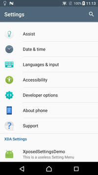

# Getting Started

## The Hard Part
The hardest part of writing an Xposed Module is actually finding the right place to change the application.
Now, if the application is open source, this is no issue, but what do you do when it's a proprietary application or a system application?

The solution has multiple steps:

1. First decide what you want to change.
2. Then you need to look at the raw code of the app (See Apktool and Dex2Jar)
⋅⋅1. If dealing with a mostly stock android package e.g. SystemUI, look at https://android.googlesource.com/ to get hints on what to patch.
3. Once you've found the method you want to hook, you can finally start writing code.

## Getting the APK
For those who aren't familiar with the process, getting the APK from an android device is rather simple
First make sure you have ADB setup and available in your favourite commandline terminal.

If you don't know the exact package name of the target application, first do:
```
adb shell pm list packages
```
The gives a complete list of all packages installed on the phone.
Once you've  found the desired one (e.g. com.android.systemui), you do
```
$ adb shell pm path com.android.systemui
package:/system/priv-app/SystemUI/SystemUI.apk
```
As is shown, this gives the exact path on the system where the given apk is listed.
Then you need to pull it like any other file
```
adb pull /system/priv-app/SystemUI/SystemUI.apk
```

## APKTool
APKTool (https://ibotpeaches.github.io/Apktool/) is a utility application that disassembles an Android APK file into it's pieces.
It's a java application that runs on your PC so you need to have java installed to run it.

Installation instructions: https://ibotpeaches.github.io/Apktool/install/

The tool is able to recover:

* AndroidManifest.xml
* All resources/native libs
* A disassembled version of all the java class files in the app

The disassembled class files are in a format called smali which is basically a simple assembly-like language. It takes some getting used to, but as the purpose mainly is finding the right method to replace/hook, it's not so important.

The AndroidManifest.xml can be used to find the entry points to the application and hence be able to trace your way to the code you want to find.

If however, it is too daunting to look at, the other option is to use Dex2Jar if the app works with it.

## Dex2jar
Dex2jar (https://github.com/pxb1988/dex2jar) is a utility that's able to take an apk file, unpack it, convert the Android Dex files to class files and repack the whole thing as a Jar file.

This has the advantage that you can use any regular Java decompiler to look at the source in a something resembling java.
A well-working decompiler is CFR (http://www.benf.org/other/cfr/)
Sadly, dex2jar has not been updated since 2015, so it doesn't really work on any APKs compiled with a too new target SDK, e.g. most 7.1.1 System apps.

### CFR Decompiler QuickUsage
1) Download CFR from http://www.benf.org/other/cfr/
2) Find your converted APK jar file
3) Run `java -jar cfr_0_123.jar path/to/file.jar --outputdir path/to/output/java-files`

Once it's finished running, you'll have a set of java files in `path/to/output/java-files`that you can open with your favourite editor to explore.

## Hooking
Xposed has a few different ways to hook functions:

1. beforeHookedMethod is called before the real function is called and allows modifying e.g. arguments passed, changing objects etc.
2. afterHookedMethod is called after the real function is called and allows affect objects after the real code has been run, modify return value of function etc.
3. replaceHookedMethod which completely replaces the real function and allows to completely replace functionality.

## Examples
### SystemUI Clock
The Tutorial example (https://github.com/rovo89/XposedBridge/wiki/Development-tutorial) asks you to setup a hook to patch the SystemUI Status Bar clock.

It is recommended to go through this tutorial to get a feel for how it works, but the premade source can also be found here:
https://github.com/EnJens/XposedClockDemo

Once it's installed, it will look like:


### Settings Menu
A simple example on how to add a new Settings category and menu on Android Nougat 7.1.1. Tested on Sony Xperia X.
It merely opens an activity on the hooking app when the item is clicked.

Source: https://github.com/EnJens/XposedSettingsDemo

Screenshot:




